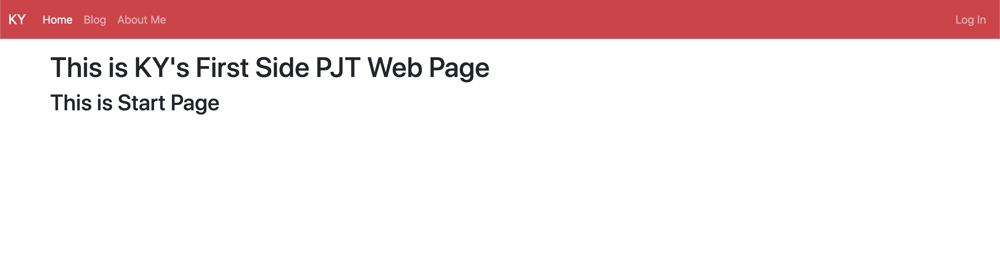
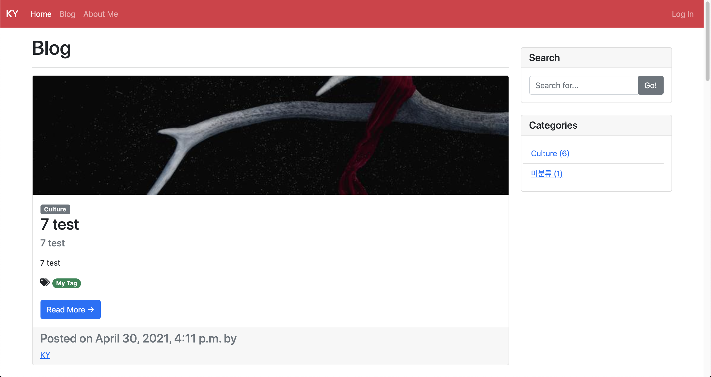
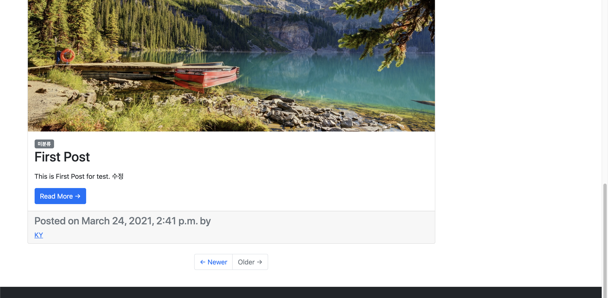
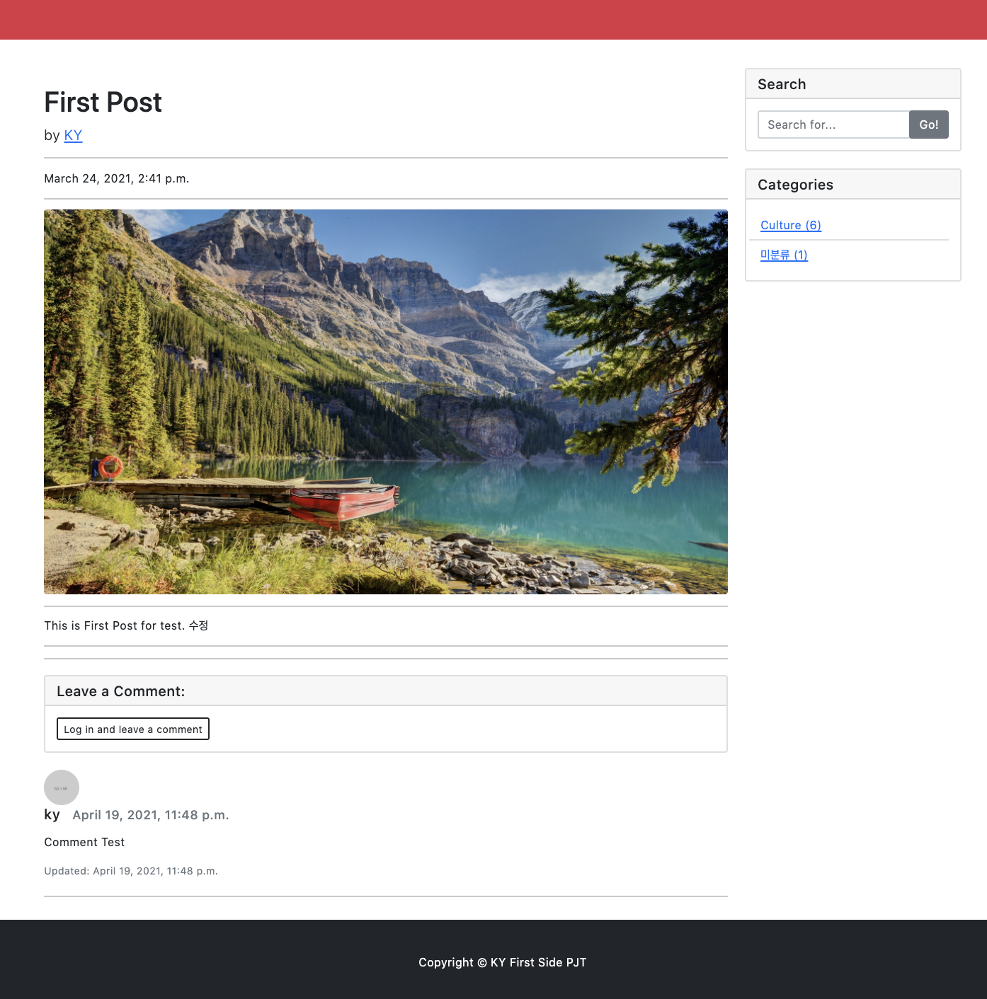
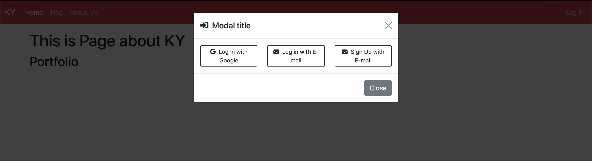
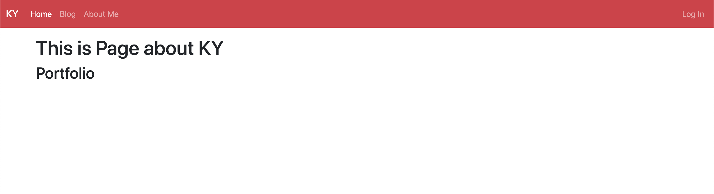

# KY_django

> 블로그

- Front-End
  - html
  - Bootstrap : CDN (Contents delivery network로 웹사이트에서 코드를 바로 가져오는 방식입니다.) v5.0.2

- Back-End
  - Django v3.2.4
- Directory
  - docs : 이미지 파일, 정리자료 디렉토리
  - python : python 학습내용 소스 관리 디렉토리
  - 나머지 : django project 소스

## Pages 

- [KY_django](#ky_django)
  - [웹서비스](#웹서비스)
    - [Front-End](#front-end)
    - [Back-End](#back-end)
      - [특징](#특징)
  - [Pages](#pages)
    - [Door Page](#door-page)
    - [Post List](#post-list)
    - [Post Detail](#post-detail)
    - [Log in](#log-in)
    - [About Me](#about-me)

### Door Page

---

### Post List

---

### Post Detail

---

### Log in

---

### About Me

